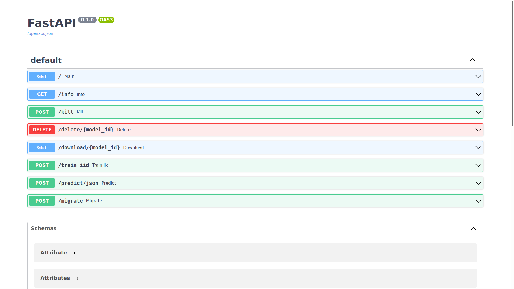
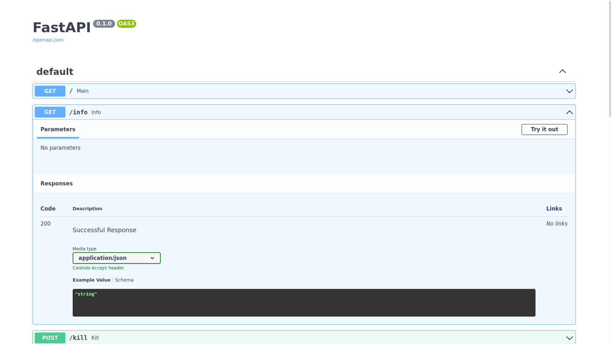
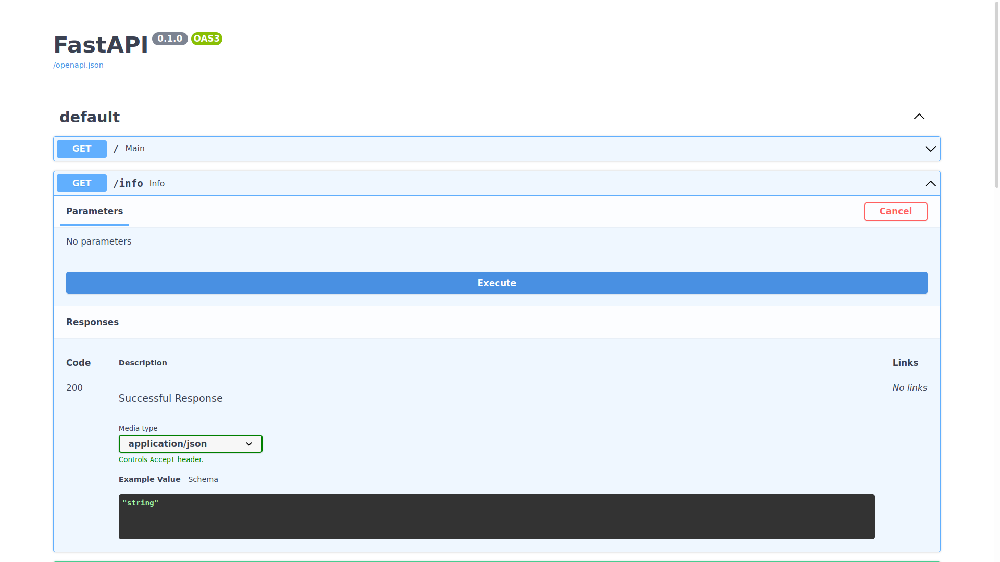
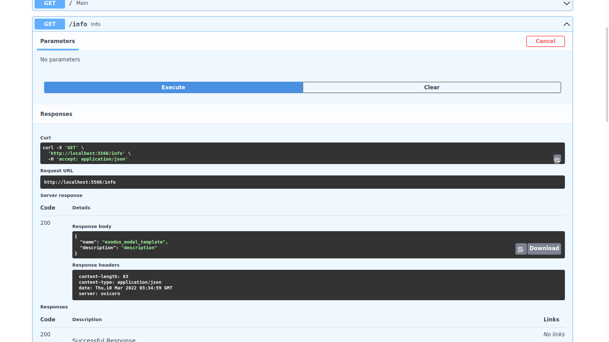
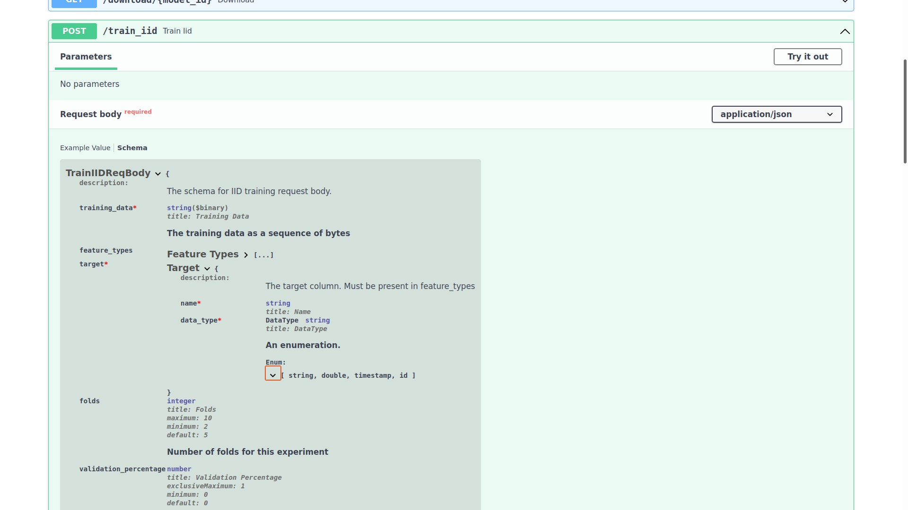

# Appendix D: How to view and use the API docs

Visit `http://{MODEL ALGORTIHM SERVICE IP}/docs`:

## Sending requests to the endpoints

You can expand any of the endpoints, and try sending requests to them like so:

## Inspecting the expected schema of an endpoint

If you want to see the required schema for a certain endpoint, expand it and click `Schema`:

