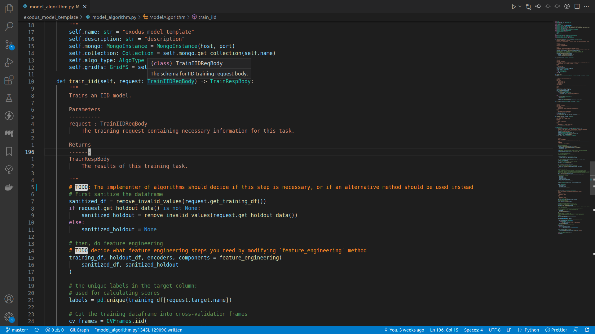
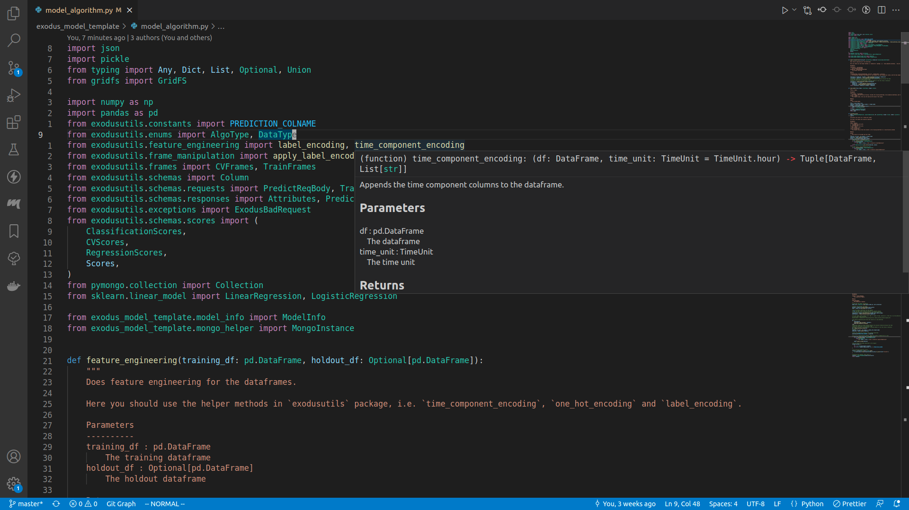

# VSCode

[VSCode](https://code.visualstudio.com/) is a modern editor that is extremely expandable.

## Basic usage

To open a VSCode session, navigate to the model algorithm template directory, and run the following command:
```bash
code .
```
This starts a VSCode session.

If you are not familiar with coding, going through [the official VSCode Python tutorial docs](https://code.visualstudio.com/docs/python/python-tutorial) is a good idea.

VSCode can recognize `poetry` environments, so make sure you select the appropriate Python interpreter (i.e. the one with your model algorithm's name in it).

## Basic hotkeys

- To expand / collapse the sidebar, press `ctrl+b`.
- To open a file, you can press `ctrl+p`.
- To type in a VSCode command, press `ctrl+shift+p`.
- To start a terminal session, press ``ctrl+shift+` ``.

## Extensions

- [Python](https://marketplace.visualstudio.com/items?itemName=ms-python.python)
    - The official extension for Python language support.
    - Once you've installed it, remember to also activate `pylance`, the type checker extension for Python language.
- [Python Indent](https://marketplace.visualstudio.com/items?itemName=KevinRose.vsc-python-indent)
    - The extension that handles indents correctly. I do not know why it is not part of the official extension, but this extension is the one that handles everything correctly.
- [autoDocstring](https://marketplace.visualstudio.com/items?itemName=njpwerner.autodocstring)
    - Makes writing comments for your algorithm that much easier.

## Screenshot





If everthing is wired up correctly, you should be able to see code definitions when your mouse is on top of an imported method or class, and there should be no unknown imports.
