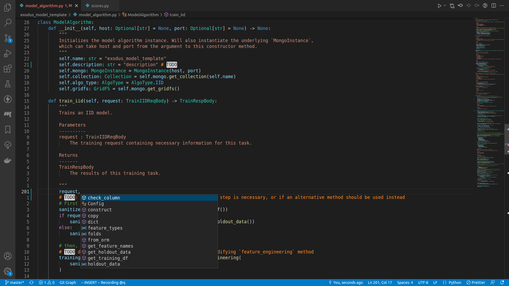
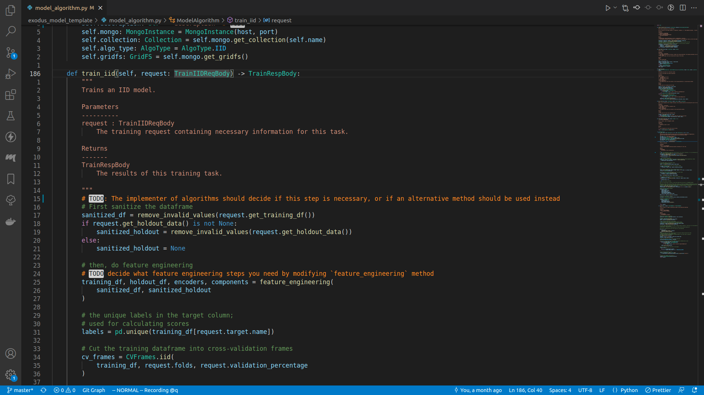

# Train a model

In order to train a machine learning model and obtain its performance metrics, we will be doing the following procedure:
1. Sanitize the training input
2. Perform feature engineering
3. Extract labels for categorical problems
4. Calculate cross validation scores
5. Train the machine learning model
6. Calculate holdout score
7. Save the model
8. Return the result

All of the code is in the files `model_algorithm.py` and `model_info.py`.

To start things off, let's modify the description of your model algorithm:

```python
class ModelAlgorithm:
    def __init__(self, host: Optional[str] = None, port: Optional[str] = None) -> None:
# ... snipped ...
        self.description: str = "description" # TODO Change me!
```

After you've figured out the description of your model algorithm, you can start implementing the `train_iid` method, the entrypoint for training an IID model.

```python
    def train_iid(self, request: TrainIIDReqBody) -> TrainRespBody:
```

If you enter a newline underneath the comments, and insert `request.`, there should be a lot of autocomplete suggestions:


The class `TrainIIDReqBody` is defined in the `exodusutils` library, and contains a myriad of helper methods and variables. If we right click on the `TrainIIDReqBody` symbol, and select `Go to definition`, we will be able to see what's in it:


```python
class TrainIIDReqBody(TrainReqBodyBase):
# ... snipped ...
    validation_data: Optional[bytes] = Field(
        default=None, description="The validation data as a sequence of bytes. Optional"
    )
    holdout_data: Optional[bytes] = Field(
        default=None, description="The holdout data as a sequence of bytes. Optional"
    )
    fold_assignment_column_name: Optional[str] = Field(
        default=None,
        description="The name of the fold assignment column. If not provided, Exodus will cut cross validation folds in a modulo fashion. If this field is defined, it is required to be a valid column in the input dataframe. This column is not included in `feature_types`, and will be discarded during training.",
    )
```
There seems to be only three fields, however the `TrainIIDReqBody` class actually inherits from the `TrainReqBodyBase` class:
```python
class TrainReqBodyBase(BaseModel):
# ... snipped ...
    training_data: bytes = Field(description="The training data as a sequence of bytes")
    feature_types: List[Column] = Field(
        default=[], description="The features present in training data"
    )
    target: Column = Field(
        description="The target column. Must be present in feature_types"
    )
    folds: int = Field(
        default=5, ge=2, le=10, description="Number of folds for this experiment"
    )
```

We will be using class `TrainIIDReqBody`'s methods and fields in the upcoming sections.
