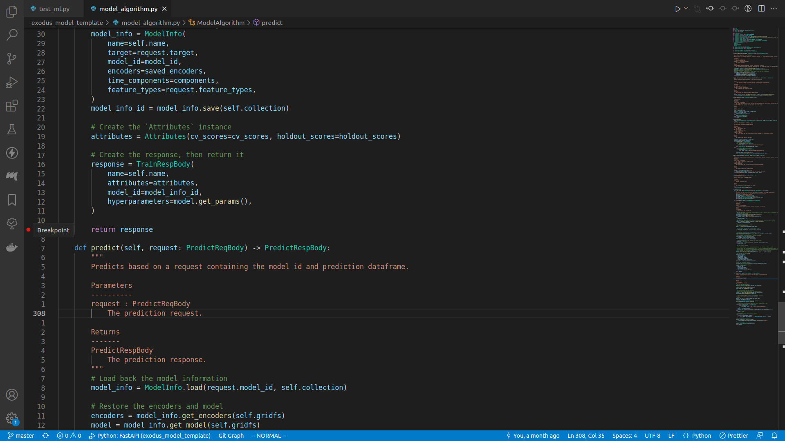
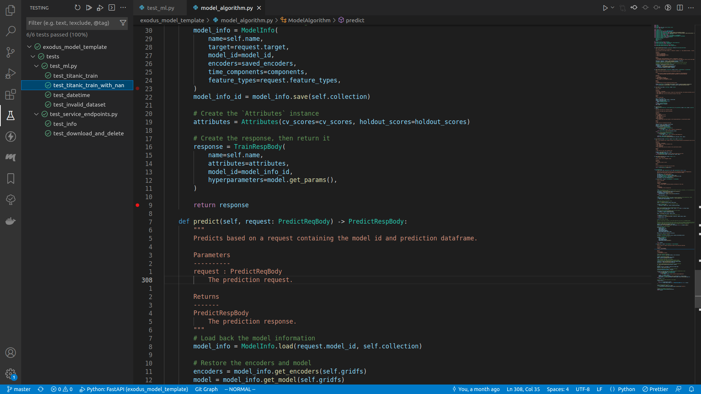
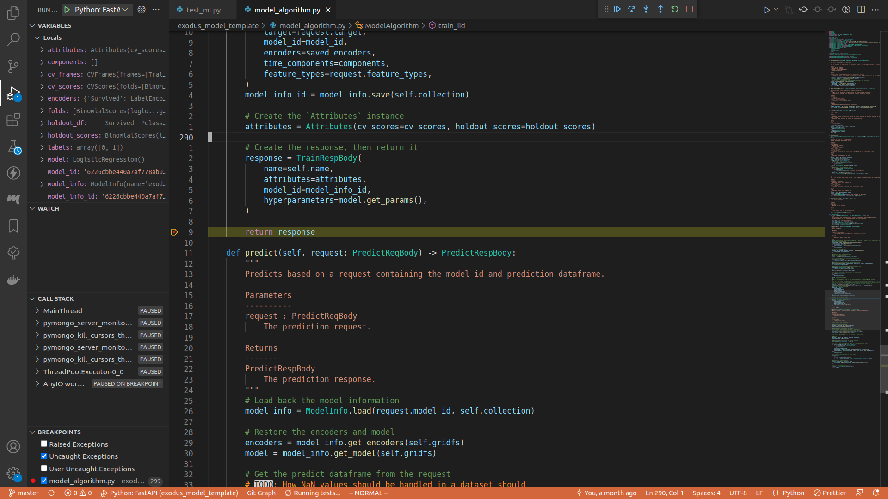
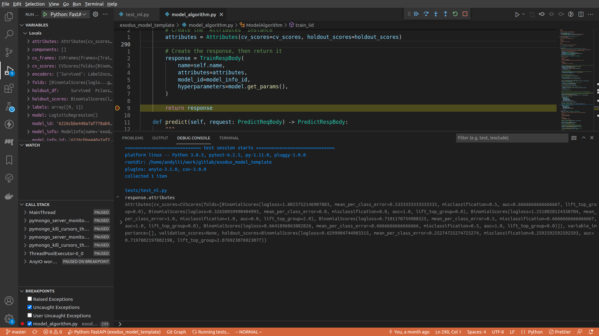
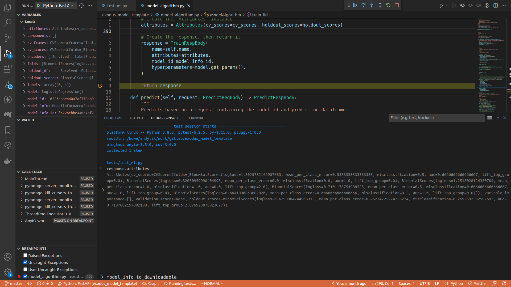
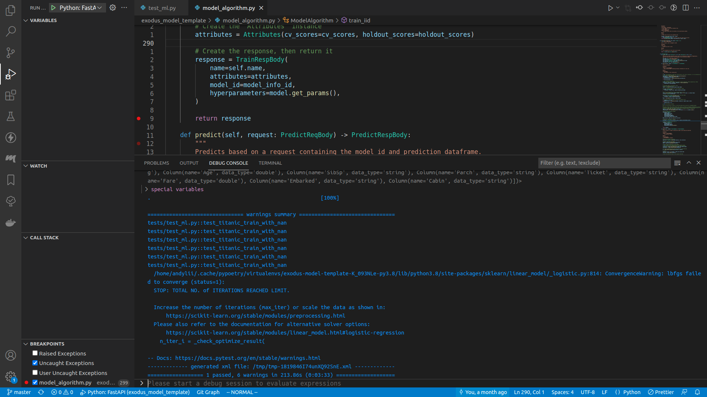

# Debugging the model algorithm

Let's say your unit test failed, and you want to figure out why. The common way to do this would be to add a lot of `print()` and hope that uncovers the issue, but actually there's a much more efficient way to debug: using a debugger.

## How to debug with a debugger

1. You set a breakpoint in your code, the breakpoint is to signal the debugger that the execution should be paused when it got to that line of code, and all execution contexts can be examined by the user
2. You use the debugger console to print various informations
3. You can jump between stacks (i.e. the method that is calling the method you're in right now)
4. You can step through the execution, so that instead of running everything and failing immediately you can actually see where the program failed

## VSCode

### Setting breakpoint

It's just clicking the empty margin on the left of the line number:



Here I set a breakpoint right before the `train_iid` method returns.

### Executing the test

You can run any specific test by expanding the drop down menu in the `testing` panel, right click on the target test method, and do `Debug test`.



Once it started running, the program will pause at the line of your breakpoint.



Toggle the debug console, or press `ctrl+shift+y`.



In the debug console, type in whatever you want to see. For example, here I typed in `request.attributes`.



Once you are done, either press the `Continue` button on the top of the screen (or press `<F5>`), or step through the execution, or do whatever you want. When the program finishes running, you can see the test result in the debug console.



## Non VSCode

I'd say using VSCode is the better choice here, but if you insist you can insert `pdb` breakpoints in your code (here I will insert a breakpoint right before `train_iid` returns):

```python
        response = TrainRespBody(
            name=self.name,
            attributes=attributes,
            model_id=model_info_id,
            hyperparameters=model.get_params(),
        )

        # THIS LINE IS THE BREAKPOINT
        import pdb; pdb.set_trace()

        return response
```

For more information, visit [the `pdb` documentation page](https://docs.python.org/3/library/pdb.html).
