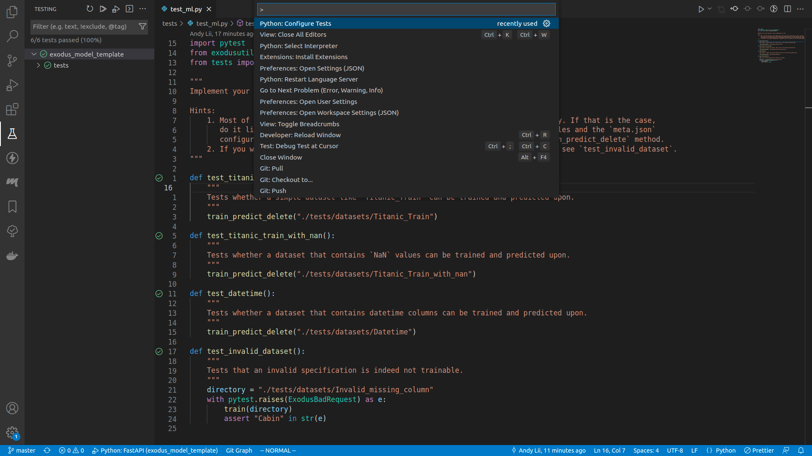
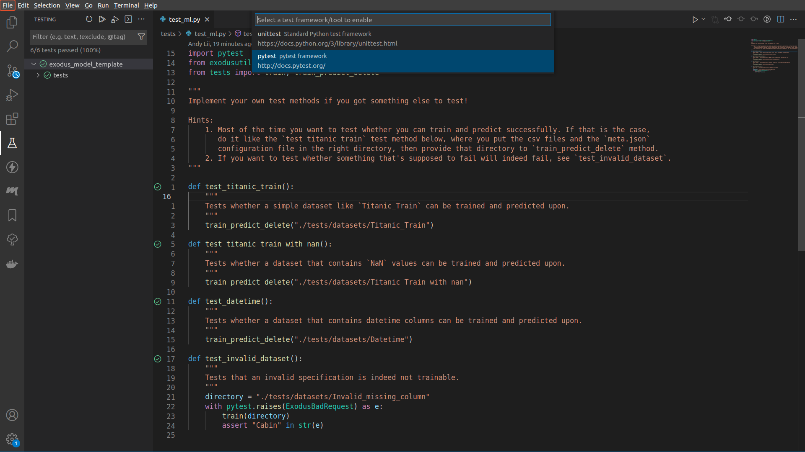
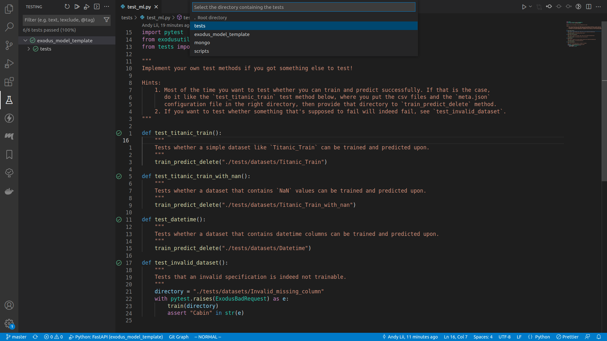
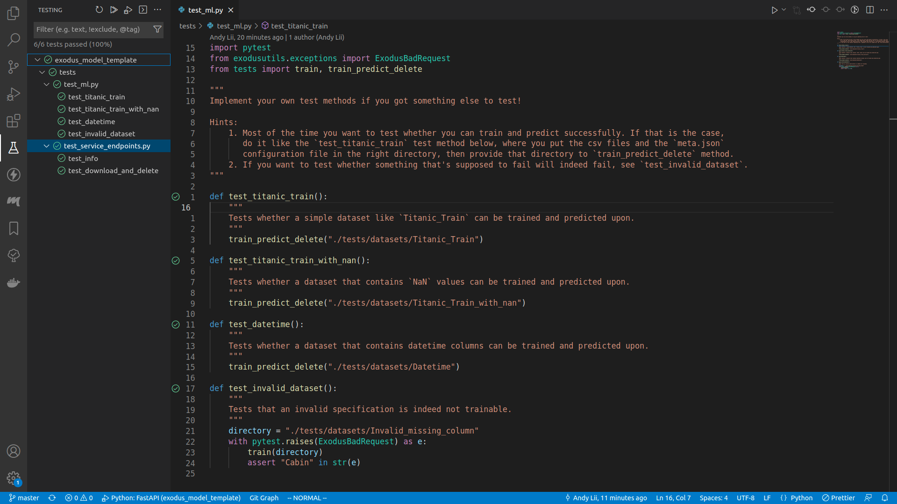

# Running unit tests

## Setup

Before you run the tests, you need to fire up the MongoDB container. This can be done via the below command:
```bash
PORT=1234 docker-compose up -d mongo
```

The `PORT` environment variable will not actually be used, it's just `docker-compose` does not realize this variable is not needed if you're only starting the MongoDB service.

Your MongoDB service will be running, and can be reached at port 27018.

## Make sure you have a MongoDB service up and running!

Otherwise all the unit tests will fail due to model algorithm timing out!

## Run the test

### Via command line

```bash
poe test
```

This will run all the unit tests within `tests/` directory, which are the files that contain a `test_` prefix in their names.

### Via VSCode

1. Press `ctrl+shift+p`, or go to `Help` > `Show All Commands`
2. Type in `Python: Configure Tests`, select that and then press `enter`
3. Select `pytest`
4. Select `tests`
5. Go to the `testing` panel






If no tests were run before the green ticks will not be there.

To run the tests, right click on the  `exodus_model_template` symbol, and select `Debug Test`.

## Write your own test

Most likely you want to make sure your model algorithm can run with some dataset you already have. To test whether your model algorithm can train and predict upon that dataset:
1. Create a directory in `tests/datasets`. Let's say `tests/datasets/foo/`
2. Move your training CSV file into `tests/datasets/foo/`, and rename it to `tests/datasets/foo/train.csv`
3. Move your prediction CSV file into `tests/datasets/foo/`, and rename it to `tests/datasets/foo/prediction.csv`
4. If you have a holdout dataset, move that file into `tests/datasets/foo/`, and rename it to `tests/datasets/foo/holdout.csv`
5. Create a new file called `tests/datasets/foo/meta.json`, which should contain the following fields:
    - `"target_column_name"`: the name of the target column
    - `"features"`: a dict from the column names to the column types. The types should all be either one of `"string"` or `"double"`
6. Write the test method by extending the `tests/test_ml.py` files:
    ```python
    def test_foo():
        train_predict_delete("./tests/datasets/foo")
    ```
    It really is as simple as that!
