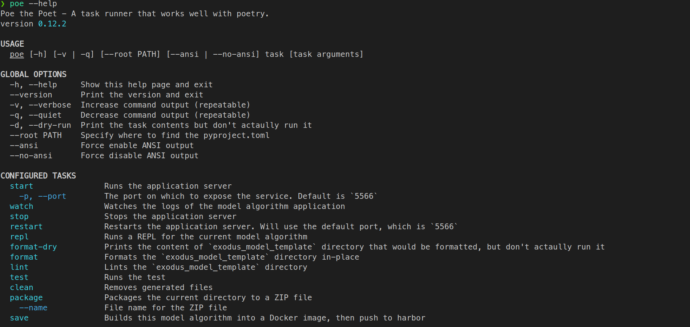

# Run the model template

As mentioned previously, the model algorithm template contains a fully functional model algorithm that can be used to train and predict. To see it in action, we have defined several commands.

## The commands

For the list of available commands, simply enter:
```bash
poe --help
```



## Run the model algorithm service

```bash
poe start

# Or if you want to specify a port:
#poe start --port [PORT]
```

This command will start a MongoDB container and a model algorithm container. By default the model algorithm container can be accessed through `http://localhost:5566/`, but you can designate a port to the command.

```bash
❯ poe start
Poe => PORT=${port} docker-compose up --build -d

# ... snipped ...

Successfully built a60ab63716b1
Successfully tagged exodus_model_template_exodus_model_template:latest
Creating exodus_model_template_exodus_model_template_1 ... done
Creating exodus_model_template_web_app_1               ... done
Creating exodus_model_template_mongo_1                 ... done
```

You can send a request to the model algorithm container to see if it is working:

```bash
❯ curl "http://localhost:5566/info"
{"name": "exodus_model_template", "description": "description"}
```

## Using the webapp to test out the model algorithm

If you go to `http://localhost:3000`, you will see a web page that allows you to test out the model algorithm. Select a CSV file, upload it and select the proper feature types, and then click `Train Model`. For predicting with a model, type in the model id, upload a CSV file for prediction, and then press `Predict`.

## Watching the model algorithm service

```bash
poe watch
```

If you do this while the service is down, the command will have no effect.

## Stoping the model algorithm service

```bash
poe stop
```

```bash
❯ poe stop
Poe => PORT=$(python scripts/stop.py);
  if test $? -eq 0; then PORT=$PORT docker-compose down; else echo "No container running, not stopping anything"; fi
Stopping exodus_model_template_mongo_1                 ... done
Stopping exodus_model_template_exodus_model_template_1 ... done
Removing exodus_model_template_mongo_1                 ... done
Removing exodus_model_template_exodus_model_template_1 ... done
Removing network exodus_model_template_default
```

If you do this while the service is down, the command will have no effect.
